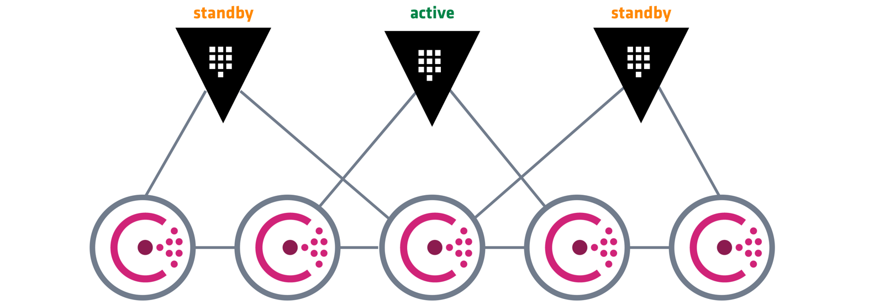

# Hashicorp Vault
**The PKI and secrets management tool**
The following document provides details about Hashicorp Vault, in particular providing details regarding our use case which will guide you.
## What
HashiCorp Vault provides a simple and effective way to manage security in cloud infrastructure. The HashiCorp Vault service secures, stores, and tightly controls access to tokens, passwords, certificates, API keys, and other secrets in modern computing.

## Why
Until very recently, we were relying on different approaches to solve similar challenges.  There was no PKI solution and we were managing certificates by hand (either self-signed or publicly signed). It was very hard to keep track of any changes, there were no audit capabilities, and in case of a security breach, it would be hard to deal rotate / revoke certificates.  At the same time, dealing with sensitive information (e.g. credentials) was also a potentially high impact risk operation.  Credentials and other sensitive information was scattered across multiple sources (such as Git repositories) and set in a hardcoded fashion. Not only this is far from ideal from a security standpoint, as it makes it a management nightmare. With vault, we can centralize and store sensitive information in a secure manner.

But vault can do much more than this:

**General Secret Storage**
At a bare minimum, Vault can be used for the storage of any secrets. For example, Vault would be a fantastic way to store sensitive environment variables, database credentials, API keys, etc.

Compare this with the current way to store these which might be plaintext in files, configuration management, a database, etc. It would be much safer to query these using  vault read  or the API. This protects the plaintext version of these secrets as well as records access in the Vault audit log.

**Employee Credential Storage**
While this overlaps with "General Secret Storage", Vault is a good mechanism for storing credentials that employees share to access web services. The audit log mechanism lets you know what secrets an employee accessed and when an employee leaves, it is easier to roll keys and understand which keys have and haven't been rolled.

**API Key Generation for Scripts**
The "dynamic secrets" feature of Vault is ideal for scripts: an AWS access key can be generated for the duration of a script, then revoked. The key-pair will not exist before or after the script runs, and the creation of the keys are completely logged.

This is an improvement over using something like Amazon IAM but still effectively hard-coding limited-access access tokens in various places.

**Data Encryption**
In addition to being able to store secrets, Vault can be used to encrypt/decrypt data that is stored elsewhere. The primary use of this is to allow applications to encrypt their data while still storing it in the primary data store.

The benefit of this is that developers do not need to worry about how to properly encrypt data. The responsibility of encryption is on Vault and the security team managing it, and developers just encrypt/decrypt data as needed.


**PKI Secrets Engine**
The PKI secrets engine generates dynamic X.509 certificates. With this secrets engine, services can get certificates without going through the usual manual process of generating a private key and CSR, submitting to a CA, and waiting for a verification and signing process to complete. Vault's built-in authentication and authorization mechanisms provide the verification functionality.

By keeping TTLs relatively short, revocations are less likely to be needed, keeping CRLs short and helping the secrets engine scale to large workloads. This in turn allows each instance of a running application to have a unique certificate, eliminating sharing and the accompanying pain of revocation and rollover.

In addition, by allowing revocation to mostly be forgone, this secrets engine allows for ephemeral certificates. Certificates can be fetched and stored in memory upon application startup and discarded upon shutdown, without ever being written to disk.


## How
Currently, Hashicorp Vault deployment is managed via pipeline and is triggered after we have the Kubernetes clusters in place. In order to provide a Highly Available setup, we use consul as the backend to store data backed by EBS volumes so that we can persist data.




Since we use Kubernetes, we also make use of the auto-unseal feature so that vault can be automatically unsealed whenever a new pod gets created.  To do so we make use of AWS KMS; you can read more about this feature 
[here](https://learn.hashicorp.com/tutorials/vault/autounseal-aws-kms) .

### How to access Vault
There are multiple ways to authenticate against vault. Currently, we have a single token that is used by the pipeline to setup all vault engines and data and no other manual access is performed. When Vault is installed and started, a file containing the token and master keys is also created. If you have access to the artefact store (we are currently using S3 for that purpose) you can retrieve it and get the token.

Please consider the following image for better understanding:


 

Now that we have the token, we need to find the address. Vault address follows the same pattern as the rest of the infrastructure. This means that since this is an internal endpoint, it will be created under the .internal domain. The FQDN is `vault.<environment>.<tenant>.<domain>.internal`

For example, in order to access the Vault instance that manages the dev environment of the tips tenant available via tips-lab.live.internal: you should open:

http://vault.dev.tips.tips-lab.live.internal/


Picture of the Vault UI.


We can use the Web UI or the CLI tool.  Just pass the token you retrieved from the previous file and that is it.  Don't forget that Vault is deployed internally which means that you need to be connected to the VPN to access it.

## Vault as PKI solution
As stated before, Hashicorp Vault was chosen to be our PKI solution. Its current configuration is still a work-in-progress and will most likely change, so please be sure to check out this time from time to time.

### Structure
The PKI setup is based on one root CA and multiple intermediate CAs. The root CA is available under  but it should not be used directly.  Instead, use the default intermediate CA for any standard use case or create your own.

This is the current structure of the vault backends:
```
/pki-root-ca
/pki-int-ca
/pki-int-ca-[simulator] (one intermediate CA per simulator)
```

Each backend has two specific roles (one for client and another one for server certificates) to restrict the type of operations that can be performed.  For example, the current configuration applied to the server simulator roles does not allow it to be used to generate client certificates or it enforces a base domain equal to the tenant. The following image shows the terraform definition for it.


 

Feel free to check out the code. If you need to create new certificates you can replicate the same methods currently in use.

### Vault as Secrets Management solution
Using Vault to manage secrets is another very important use-case.  Applications require credentials, keys, and other sensitive information to connect to other dependencies. Unfortunately, the way this information is being handled is unsafe and ineffective as it is very common to see hardcoded credentials stored in plaintext and spread across multiple repositories.  Storing credentials or keys in plain text makes it insecure, and hardcoding them turns into a nightmare whenever we need to update them (e.g. how many different places/dependencies do we have to update?).

Using Vault solves multiple challenges at once. For example, we can now centralize information while keeping it safe following the PoLP. If application A requires access to database X and API keys for service Y we can create a specific vault policy that will allow that so that A can retrieve it when it is being initialized. At the same time, application A only needs read access which means that we can safely disable the possibility of changing its value. This reduces the attack surface in case of a security breach.

Vault policies are usually attacked to roles and/or tokens and provide this kind of segregation.

The following image shows a vault policy attached to a role that allows two secrets to be read.


For now, the infrastructure team is just using it to store whitelist endpoints, but the plan is to migrate all secrets to Vault so that it can be the source of truth from an infrastructure perspective.

 

### Integrating Vault with applications running on Kubernetes
Kubernetes is a critical component of our infrastructure as it is the platform where most of our applications run. 

Integrating Vault with Kubernetes workloads provides a very smooth and transparent operation. In order to use vault our applications need to:


- Authenticate and acquire a client token.
- Manage the lifecycle of the token.
- Retrieve secrets from Vault.
- Manage the leases of any dynamic secrets.

There are several ways to achieve this. The infrastructure team decided to use a Vault agent which gets deployed as a side car and takes care of all those steps transparently. 
You can read more about the agent deployed as a sidecar here.

Assuming that vault agent is already configured on your system,  and we have the secrets in place all it takes is a couple of annotations added to our pod:

```
vault.hashicorp.com/agent-inject: "true" 
vault.hashicorp.com/role: "internal-app" 
vault.hashicorp.com/agent-inject-secret-database-config.txt: "internal/data/database/config"
```
These annotations define a partial structure of the deployment schema and are prefixed with vault.hashicorp.com.
- agent-inject enables the Vault Agent injector service
- role is the Vault Kubernetes authentication role
- agent-inject-secret-FILEPATH prefixes the path of the file, database-config.txt written to the /vault/secrets directory. The value is the path to the secret defined in Vault.

You can see a real example if you check our IAC repository and look at the extgw module. Using it as an example it currently produces the following real result:


Your application can then just use the secrets mounted as files ( main-wl-config.xml, sim-wl-config.xml.

### Integrating Vault with other software:
In some cases, we might not be using a platform that natively supports vault. In those cases, we can also make use of another small (but powerful) tool called confd. 

Confd is a very small configuration management tool and works with many different backends, one of which is Vault.  It supports a daemon mode that can poll the backend and monitor changes to secrets. Whenever it finds those changes, it can rebuild the config files and take actions (e.g. reload a given application).  We currently use confd to ensure that our IP based whitelists used by haproxy are always up to date. For more details, you can check our infrastructure code.


An example of confd retrieving data from vault to generate the ip_whitelist


### Using ISKM as a centralized identity service:  


Vault is a feature-rich platform whose flexibility allows it to be used in many different ways.  Another interesting use-case would be to delegate the authentication to a central authority such as ISKM  which would simplify the user management tasks.  It already provides many authentication methods to integrate with 3rd party tools.


### References:
1. [https://cloudacademy.com/course/hashicorp-vault/hashicorp-vault-architecture/](https://cloudacademy.com/course/hashicorp-vault/hashicorp-vault-architecture/)
1. [https://www.vaultproject.io/docs/platform/k8s/injector](https://www.vaultproject.io/docs/platform/k8s/injector)
1. [https://learn.hashicorp.com/vault/kubernetes/sidecar](https://learn.hashicorp.com/vault/kubernetes/sidecar)
1. [https://github.com/modusintegration/mojaloop-platform-iac](https://github.com/modusintegration/mojaloop-platform-iac) - Connect to preview 
