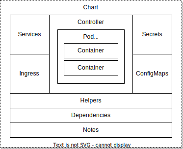

# Helm - best practice
WIP Notes:

*   Currently defining the outline of this document, with some notes in each section of what I want to include (anybody reading, please feel free to make suggestions to either sections or content, also let me know if you would like to contribute directly)
    
*   indicate where possible what is not compatible with helm v2, and if there is a way to match it in v2.
    
*   …
    

## 1. General

   

| **#** | **Description** | **Convention** | **Example** |
| -- | -- | -- | -- |
| 1 | Chart Name | 1.  Chart names are lower case with letters & numbers. <br>2.  Words can be separated by using a dash `-`.  | `mojaloop`<br>`mojaloop-frontend`<br>`mojaloop-backend-api` |
| 2 | Folders | 1.  Directory must have the same name as the chart.| `./mojaloop`<br>`./mojaloop-frontend`<br>`./mojaloop-backend-api`| 
| 3 | Chart Version | 1.  SemVer 2 is used: `MAJOR.MINOR.PATCH`, refer to [https://semver.org/](https://semver.org/) | `1.0.0`<br>`0.0.1-alpha`<br>| 
| 4 | App Version | 1.  Specific to the application & use-case - i.e. no standard enforced<br>2.  Should be consistent throughout Helm repository<br>3.  Preferably use SemVer 2: `MAJOR.MINOR.PATCH`, refer to [https://semver.org/](https://semver.org/), when a single application is represented by the chart<br>4.  Concatenated string for multiple application when defining an Umbrella-Chart, each application separated by a semi-colan using this format: `<app1>: <SemVer>; <app2>: <SemVer>`| Single Chart: `1.0.0`<br>Umbrella Chart: `central-ledger: 1.0; ml-api-adapter: 2.0` | 
| 5 | YAML| 1.  Indentation using 2 spaces<br>2.  Do not use tabs <br>3.  Use single-space between words or characters <br>4.  Dash `-` can be used in keys <br>5.  Camalcase can be used in keys<br>6.  Use either 4 or 5, preferably do not mix<br>7.  Keys must start with an alphanumeric character<br>8.  Multi-line strings are supported by using `|`, which will maintain newlines <br> 9.  Multi-line strings are supported by using `>`, which will fold newlines <br> 10.  Anchor-tags should be used as variables, and referenced appropriately to reduce duplication. | Example YAML: <br>```yaml <br> top:  value1: 123   value2: &value2var "123"  copy-of-value2: *value2var  next-level-obj: &objvar    next-level-value: "hello"    formatedParagraph:       This is a multiline with      maintains newline characters.     singleLineParagraph: >      This will be reformatted      into a single line  copy-of-next-level-obj: *objvar``` | 

## 2. Labels

The table below shows how the recommend K8s labels should be utilised in a Helm chart: [https://kubernetes.io/docs/concepts/overview/working-with-objects/common-labels/](https://kubernetes.io/docs/concepts/overview/working-with-objects/common-labels/)

 
| **#** | **Name** | **Required** | **Description** | **Definition** | 
| --- | --- | --- | --- | --- |   
| 1 | `app.kubernetes.io/name` | Yes |The application name.|  ```{{ include "<MYCHART>.name" . } }``` |
| 2 | `helm.sh/chart` | Yes | The chart name and version. | `{{ .Chart.Name } }-{{ .Chart.Version \| replace "+" "_" } }` | 
| 3 | `app.kubernetes.io/managed-by` | Yes | Used by Helm to identify managed resources.| `{{ .Release.Service } }` | 
| 4 | `app.kubernetes.io/instance` | Yes | Used to differentiate between different instances of the same application.| `{{ .Release.Name } }` |
| 5 | `app.kubernetes.io/version` | No| The version of the application/s deployed.|`{{ .Chart.AppVersion } }` | 
| 6 | `app.kubernetes.io/component`| No| User defined common label for marking the role of each component within a deployment.| `frontend`<br>`backend`| 
| 7| `app.kubernetes.io/part-of`| No | Useful when multiple charts or deployments are representative of a single complex application, i.e. a product.| `portx`<br>`mojaloop`| 

:::warning
Changing the `required` label definitions may impact the upgradability of existing deployments.
:::

These labels will be used by Helm to identify the deployed resources within a specific release. This will enable Helm to manage those resources, and provide supporting operations such as upgrading or destroying releases.

It is recommended that one defines a **named template** function in your Helm chart’s `_helpers.tpl`, which should be referenced in all of your Helm chart descriptors to ensure consistency and maintainability:

:::warning
Named templates have **global** scope. This means any charts installed as part of the same release could have a template name collision. This includes parent charts, child charts, sibling charts, grandparent charts, etc. Therefore, use a relevant and specific name to reduce the probability of a name collision. Bad template names include, for example: `database`, `cache`, `shared`. It is convention to prefix each defined template with the name of the chart, e.g. `my-chart.database`.
:::

```yaml 
{{/*
Standard Labels Template function used across all charts.
*/}}
{{- define "<MYCHART>.labels" -}}
app.kubernetes.io/name: {{ include "<MYCHART>.name" . }}
app.kubernetes.io/instance: {{ .Release.Name }}
app.kubernetes.io/managed-by: {{ .Release.Service }}
app.kubernetes.io/part-of: <PRODUCTNAME>
helm.sh/chart: {{ .Chart.Name }}-{{ .Chart.Version \| replace "+" "_" }}
{{- end -}}
```

Example usage of the **named template** `<MYCHART>.labels` in a Deployment descriptor file:

```yaml 
---
apiVersion: apps/v1
kind: Deployment
metadata:
  name: {{ include "<MYCHART>.name" . }}
  labels:
    {{- include "<MYCHART>.labels" . | nindent 4 }}
spec:
  replicas: {{ .Values.replicas }}
...
```

:::warning
Ensure you replace `<MYCHART>` with your Helm chart’s name.
:::

The above example template function can easily be defined into a common [Library Chart](https://modusbox.atlassian.net/wiki/spaces/CK/pages/1143341130/Best+Practices#3.3.-Library-Chart), making it reusable through many charts.

## 3. Charts

### 3.1. Single Chart

This basic single chart scenario is representative of a single unit of deployment, i.e. a single microservice which may contain its direct dependencies, such as datastores, sidecars, etc.

It will also contain its own:

*   configuration (configMaps, secrets);    
*   provides a mechanism for service discovery and load-balancing, internally (via services) or externally (via ingress); and    
*   ability to attach local or network storage for persistence.
    
#### 3.1.1. Overview


 

| **Descriptor** | **Description** | 
| --- | --- | 
| Chart | A collection of files that generate Kubernetes resources. The Kubernetes resource together represent a unit of deployment for a service or application.<br>More info [here](https://helm.sh/docs/topics/charts/#:~:text=Helm%20uses%20a%20packaging%20format,%2C%20caches%2C%20and%20so%20on.).| 
| Controller | Describes the service or application workload controller, this can be one of the following k8s descriptors: <br> - [Deployment](https://kubernetes.io/docs/concepts/workloads/controllers/deployment/)<br>- [ReplicaSet](https://kubernetes.io/docs/concepts/workloads/controllers/replicaset/)<br> - [StatefulSet](https://kubernetes.io/docs/concepts/workloads/controllers/statefulset/)<br> - [DaemonSet](https://kubernetes.io/docs/concepts/workloads/controllers/daemonset/)<br> - [Job](https://kubernetes.io/docs/concepts/workloads/controllers/job/) / [Cronjob](https://kubernetes.io/docs/concepts/workloads/controllers/cron-jobs/) <br> More info [here](https://kubernetes.io/docs/concepts/workloads/).| 
| Pod | Describes the smallest deployable unit of your service or application. This generally is representative of one or more tightly coupled container. | 
| ConfigMap | A ConfigMap is a descripter used to store non-confidential data in key-value pairs. Pods can consume ConfigMaps as environment variables, command-line arguments, or as configuration files in a volume.| 
| Secret | A Secret is an object that contains a small amount of sensitive data such as a password, a token, or a key. Such information might otherwise be put in a Pod specification or in an image. Users can create Secrets and the system also creates some Secrets. | 
| Service | An abstract way to expose an application running on a set of Pods as a network service. This generally provides basic internal load-balancing capabilities between scaled pods, but can be configured using external load-balancers on cloud-providers (such as AWS, GC, Azure, etc).| 
| Ingress | An descriptor that manages external access to the services in a cluster, typically HTTP; which may provide load balancing, SSL termination and name-based virtual hosting. | 
| Helpers | Standard Helm file “\_helpers.tpl” that stores general re-usable template functions within a chart. | 
| Dependencies | Either an external or internal Helm Chart/s that are a dependency to a “parent” Helm Chart. When the Helm Chart is deployed, those dependencies will be included in the releases, and can be configured appropriately. | 
| Notes | Standard Helm file “notes.txt” that stores templatable instructions that are displayed post-deployment. Instructions on how to access, use the application or just next-steps can be displayed via the stdout console. | 

#### 3.1.2. Folder Structure
```
chart-name
├── Chart.yaml          # Chart information
│
├── templates           # Directory containing Templates which will 
│ │                       generate Kubernetes manifest files when 
│ │                       combined with values configuration.
│ │
│ ├── NOTES.txt         # Documentation that is displayed after deployment
│ │
│ ├── _helpers.tpl      # File containing re-usable template-functions
│ │
│ ├── <workload>.yaml   # Workload controller - one or more of the following: 
│ │                       deployment
│ │                       statefulset
│ │                       daemonset
│ │                       job
│ │                       cronjob
│ │
│ ├── ingress.yaml      # List of external access rules, routes and mappings
│ │
│ ├── service.yaml      # List of internal network abstraction to expose Pods
│ │
│ ├── config.yaml       # List of application configuration (files, env, etc)
│ │
│ ├── secret.yaml       # List of application secrets (files, env, etc)
│ │
│ ├── tests             # Folder containing tests that can be executed post
│ │ │                     deployment for a specific release.
│ │ ├── <test>.yaml     # Individual tests.
│ 
└── values.yaml         # Default configuration for this chart.
```

#### 3.1.3. Resources


:::tip Kubernetes resources

Controllers: [https://kubernetes.io/docs/concepts/workloads/controllers/](https://kubernetes.io/docs/concepts/workloads/controllers/)

Ingress: [https://kubernetes.io/docs/concepts/services-networking/ingress/](https://kubernetes.io/docs/concepts/services-networking/ingress/)

Services: [https://kubernetes.io/docs/concepts/services-networking/service/](https://kubernetes.io/docs/concepts/services-networking/service/)

ConfigMap: [https://kubernetes.io/docs/concepts/configuration/configmap/](https://kubernetes.io/docs/concepts/configuration/configmap/)
:::

:::tip Helm resources

Helm Chart Tests: [https://helm.sh/docs/topics/chart\_tests/](https://helm.sh/docs/topics/chart_tests/)
:::

### 3.2. Umbrella Chart


This scenario describes an Umbrella-Chart that represents a container (parent-chart) that includes several child or sub-charts. This allows the umbrella-chart to package several charts into a single deployment.

For example, in Mojaloop a top-level umbrella-chart called “mojaloop” provides a packaged deployment for all of Mojaloop’s components (Central-Ledger, Account-Lookup, Quoting-Service, Central-Settlements), which are available separately as individually deployable charts. This umbrella-chart represents the core Mojaloop “application” which is required for a Switch Operator.

#### 3.2.1. Overview


#### 3.2.2. Folder Structure

```
chart-name
├── Chart.yaml            # Chart information which includes dependency links
│                           sub-chart-1
├── templates             # Directory containing Templates
│ ├── NOTES.txt           # Documentation that is displayed after deployment
│ ├── _helpers.tpl        # File containing re-usable template-functions
│ ├── ingress.yaml        # List of external access rules, routes and mappings
│ ├── secret.yaml         # List of application secrets (files, env, etc)
│ ├── tests               # Folder containing tests for post deployment
│ │ ├── <test>.yaml       # Individual tests for umbrella-chart
└── values.yaml           # Default configuration for umbrella-chart and 
│                           and sub-charts (e.g. sub-chart-1)
│
├── lib-chart-1           # Directory containing library chart
│ ├── Chart.yaml          # Library Chart information
│ ├── templates           # Directory containing Templates
│ │ ├── NOTES.txt         # Documentation that is displayed after deployment
│ │ ├── _helpers.tpl      # File containing re-usable template-functions
│ └── values.yaml         # Default configuration for this lib-chart.
│
├── sub-chart-1           # Directory containing sub-chart which 
│ │                         includes dependency links to lib-chart-1
│ ├── Chart.yaml          # Chart information
│ ├── templates           # Directory containing Templates
│ │ ├── NOTES.txt         # Documentation that is displayed after deployment
│ │ ├── _helpers.tpl      # File containing re-usable template-functions
│ │ ├── <workload>.yaml   # Workload controller - one or more of the following: 
│ │ ├── ingress.yaml      # List of external access rules, routes and mappings
│ │ ├── service.yaml      # List of internal network abstraction to expose Pods
│ │ ├── secret.yaml       # List of application secrets (files, env, etc)
│ │ ├── tests             # Folder containing tests that can be executed post
│ │ │ ├── <test>.yaml     # Individual tests.
│ └── values.yaml         # Default configuration for this sub-chart.
```

#### 3.3.2. Versioning

### 3.3. Library Chart

This scenario describes a “library” chart that contains reusable template-functions that can be shared across several charts.

:::warning
This feature is not available in Helm v2
:::

#### 3.3.1. Overview


#### 3.3.2. Folder Structure

```
chart-name
├── Chart.yaml            # Chart information which includes dependency links
│                           sub-chart-1
├── templates             # Directory containing Templates
│ ├── NOTES.txt           # Documentation that is displayed after deployment
│ ├── _helpers.tpl        # File containing re-usable template-functions
│ ├── ingress.yaml        # List of external access rules, routes and mappings
│ ├── secret.yaml         # List of application secrets (files, env, etc)
│ ├── tests               # Folder containing tests for post deployment
│ │ ├── <test>.yaml       # Individual tests for umbrella-chart
└── values.yaml           # Default configuration for umbrella-chart and 
│                           and sub-charts (e.g. sub-chart-1)
│
├── lib-chart-1           # Directory containing library chart
│ ├── Chart.yaml          # Library Chart information
│ ├── templates           # Directory containing Templates
│ │ ├── NOTES.txt         # Documentation that is displayed after deployment
│ │ ├── _helpers.tpl      # File containing re-usable template-functions
│ └── values.yaml         # Default configuration for this lib-chart.
│
├── sub-chart-1           # Directory containing sub-chart which 
│ │                         includes dependency links to lib-chart-1
│ ├── Chart.yaml          # Chart information
│ ├── templates           # Directory containing Templates
│ │ ├── NOTES.txt         # Documentation that is displayed after deployment
│ │ ├── _helpers.tpl      # File containing re-usable template-functions
│ │ ├── <workload>.yaml   # Workload controller - one or more of the following: 
│ │ ├── ingress.yaml      # List of external access rules, routes and mappings
│ │ ├── service.yaml      # List of internal network abstraction to expose Pods
│ │ ├── secret.yaml       # List of application secrets (files, env, etc)
│ │ ├── tests             # Folder containing tests that can be executed post
│ │ │ ├── <test>.yaml     # Individual tests.
│ └── values.yaml         # Default configuration for this sub-chart.
```

### 3.3. Common Chart

In this scenario, we have a single chart that can be deployed and configured to operate in different modes.

A good example of this would be the Central-Ledger component in Mojaloop. One is able to configure CLI parameters/flags to start the Central-Ledger in the desired mode. For example, one can start the Central-Ledger as a Prepare-Handler, Position-Handler, Fulfil-Handler or a Service-Handler.

One can achieve this by defining a single common-chart which is declared as multiple dependencies on the umbrella-chart, each with a different `alias`. This allows one to customize each one of the `alias`'s in the umbrella-chart’s values configuration.

#### 3.3.1. Overview

**TBD**

#### 3.3.2. Folder Structure

```
chart-name
├── Chart.yaml            # Chart information which includes dependency links
│                           containing an alias to common-chart:
│                             alias: front-service
│                             alias: backend-service
├── templates             # Directory containing Templates
│ ├── NOTES.txt           # Documentation that is displayed after deployment
│ ├── _helpers.tpl        # File containing re-usable template-functions
│ ├── ingress.yaml        # List of external access rules, routes and mappings
│ ├── secret.yaml         # List of application secrets (files, env, etc)
│ ├── tests               # Folder containing tests for post deployment
│ │ ├── <test>.yaml       # Individual tests for umbrella-chart
└── values.yaml           # Default configuration for umbrella-chart and 
│                           contains customized values for each alias:
│                             alias: front-service
│                             alias: backend-service
├── common-chart           # Directory containing sub-chart which 
│ ├── Chart.yaml          # Chart information
│ ├── templates           # Directory containing Templates
│ │ ├── ...
│ │ ├── tests             # Folder containing tests that can be executed post
│ │ │ ├── ...
│ └── values.yaml         # Default configuration for this sub-chart.
```

## 4. Version Strategies

….

## 5. Project Structure

… single chart vs umbrella-charts

… documentation

… repositories

… makefile

… tests

… etc

### 6. Configuration

… env variables

… file mounts

… annotations

### 7. Policies

… affinity, resources, etc)

### 8. Security

… Main section to include all security aspects

7.1. Secrets

… externalizing secrets

…

### 9. Service Discovery

… service strategies

… ingress

### **10. Monitoring**

… readinessProbe

… livenessProbe

…

### 11. Dependencies

… external requirement dependencies

… bootstrap / init-containers

… what happens if you need to override a chart that you do not have direct control over….fork vs kustomize

### 12. Deployment Strategies

… Mono repositories

… inline charts

… GitOps, e.g. Flux, ArgoCD

… Upgrades ← always make changes through Helm, and upgrade existing deployments so the “release history” is available. DO NOT make changes or edits directly on k8s. Also include persistence dependency (i.e. Database schema changes, etc)

## 13. Testing & Verification

### 13.1 Linting

The `helm lint` command verifies that a chart is well-formed. It will fail with a non-zero exit code and print an error to `stdout` when any of the following problems are found in the chart:

*   invalid template syntax, such as
    
    *   unmatched parentheses
        
    *   unmatched `range`, `if`, or `with` statements, which must terminate with `end`
        
*   missing variable references in templates
    

Notably missing here is that `helm lint` is validating template syntax but _not_ manifest correctness. In other words, we should be able to specialise (build, package, template) a chart which passes `helm lint`, but we may not be able to _install_ it. This leads us to the next section.

### 13.2 Validation

Helm does not provide a facility for testing the correctness of generated manifests. We thus recommend an additional tool for this purpose: `kubeval`. Skip to [https://modusbox.atlassian.net/wiki/spaces/PORTXINFRA/pages/1143341130/Best+Practices+WIP#Usage-With-Helm-Charts](https://modusbox.atlassian.net/wiki/spaces/PORTXINFRA/pages/1143341130/Best+Practices+WIP#Usage-With-Helm-Charts) for practical usage examples.

#### Background

Each Kubernetes resource, for example a _Deployment_ or a _Service_ has a manifest spec that a manifest must comply with in order to be accepted and created in the cluster. These specs encode rules such as “a _Deployment_ must have a `metadata` property, of type object” and “a _Deployment_ `metadata` object must have a `name` property, of type string”. Therefore, if one attempts to create a _Deployment_ lacking `metadata.name`, for example with `kubectl apply -f mydeployment.yaml` Kubernetes will reject it. It is possible to generate such a manifest with Helm.

#### Kubeval Examples

A valid manifest:
```
#!/usr/bin/env bash
MANIFEST=$(cat << EOF
apiVersion: apps/v1
kind: Deployment
metadata:
  name: my-deployment
EOF
)
echo "$MANIFEST" | kubeval --strict -v 1.18.0
```
Result:

```
PASS - stdin contains a valid Deployment (my-deployment)
```

An invalid manifest:
```
#!/usr/bin/env bash
MANIFEST=$(cat << EOF
apiVersion: apps/v1
kind: Deployment
metadata:
  name: # missing
EOF
)
echo "$MANIFEST" | kubeval --strict -v 1.18.0
```

Result:
```
ERR - stdin: Expected string value for key 'metadata.name'
```

Some CRDs do not publish up-to-date manifest specs. When they do not, you may need to use `--ignore-missing-schemas`:

```
#!/usr/bin/env bash
CRD_MANIFEST=$(cat << EOF
apiVersion: custom.io/v1
kind: Custom
metadata:
  name: custom
EOF
)
echo "$CRD_MANIFEST" | kubeval --strict --ignore-missing-schemas -v 1.18.0
```

#### Usage With Helm Charts

We recommend, as a minimum, templating vanilla charts and validating them with `kubeval`. Example:

```bash
 #!/usr/bin/env sh helm template . | kubeval --strict -v 1.18.0
 ```

Better is to specialise our charts by specifying values, then validate them:

```bash 
#!/usr/bin/env sh helm template . --set some.config="some-value" | kubeval --strict -v 1.18.0
```

In most cases you’ll want to validate more complex values. A more realistic example:
```bash
#!/usr/bin/env bash
POD_AFFINITY="$(cat << EOF
affinity:
  nodeAffinity:
    requiredDuringSchedulingIgnoredDuringExecution:
      nodeSelectorTerms:
      - matchExpressions:
        - key: kubernetes.io/e2e-az-name
          operator: In
          values:
          - e2e-az1
          - e2e-az2
    preferredDuringSchedulingIgnoredDuringExecution:
    - weight: 1
      preference:
        matchExpressions:
        - key: another-node-label-key
          operator: In
          values:
          - another-node-label-value
EOF
)"

echo "$POD_AFFINITY" | helm template . -f - | kubeval --strict -v 1.18.0
```

### 12.3 Helm Tests

\[TODO\]

…testing for helmv2 via post-hook jobs

…. helm test command in helm v3

:::warning
This feature is not available in Helm v2
:::

:::tip Helm resources
Helm Chart Tests: [https://helm.sh/docs/topics/chart\_tests/](https://helm.sh/docs/topics/chart_tests/)
:::

### 12.4 Summary

We recommend linting _then_ `kubeval` validation in a CI pipeline. This is because an error caught by linting is likely to cause a manifest validation error, therefore a lint error is likely to be easier to debug.

\[TODO\] add summary section on helm tests